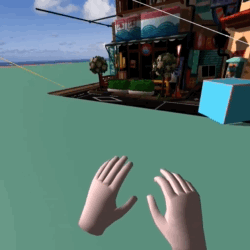
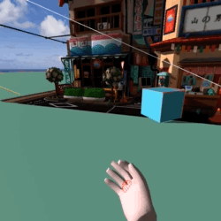
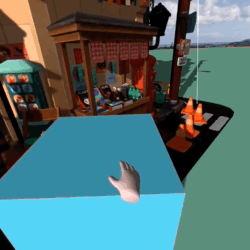
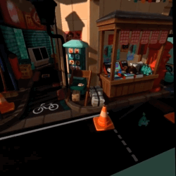
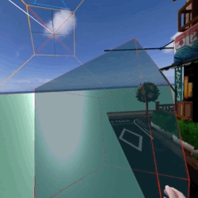

# AFrame boilerplate

This boilerplate uses CDN scripts, and can be used as-is. It aims to demonstrate:

1. Initiate scene making all helpers visible (physics colliders, shadow camera...). Load a gltf object from file, load spherical image to use as sky, place a plane and a cube primitives. 
1. link controllers using super-hands

    
        
1. Teleport using aframe-teleport-controls

    
1. Demonstrate custom componet which truns object transparent when grabbed. Also note that the shadow camera target is linked to the box. Moving the box moves the angle of the light.

    
1. Demostrate shadow camera

    
1. Demostrate physics

    

# Installation
1. Pull the repo down, and serve `src` folder from a webserver.

1. Please note that the [`aframe-physics-system`](https://github.com/n5ro/aframe-physics-system) is broken. It has stale dependancies and is not compatible with the latest [`AFrame`](https://aframe.io/) and [`Three.js`](https://threejs.org/). 

    This boilerplate uses [`githack`](http://raw.githack.com/) to pull out the latest build (not in CDNs), and it also pulls in deprecated [`Geometry.js`](https://github.com/mrdoob/three.js/tree/dev/examples/js/deprecated) which the physics module requres.

# Demo
You can find the complied demo on [our hackathon page](https://zonehackvr.z33.web.core.windows.net/af/index.html).